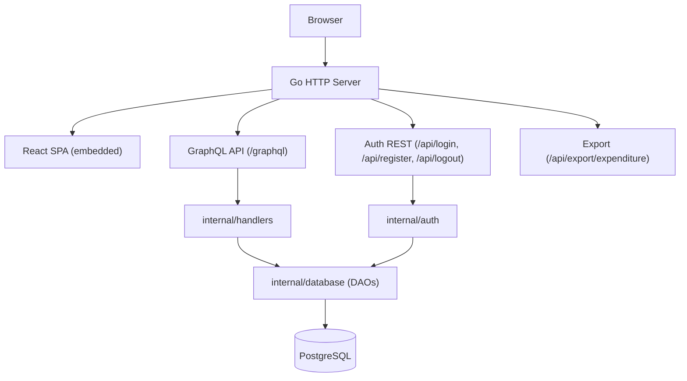
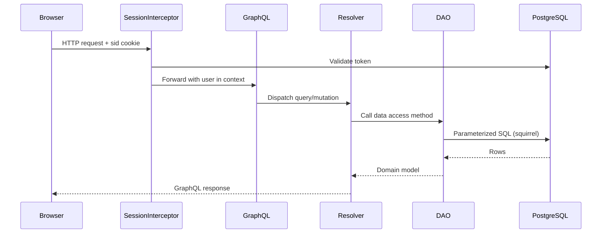

# Codebase Overview

## Purpose

YABA (Yet Another Budgeting App) is a self-hosted personal budgeting application that tracks spending, manages budgets and expense categories, and surfaces credit card reward opportunities based on actual spending patterns.

## Architecture

A Go HTTP server embeds the React frontend as static files and exposes a GraphQL API backed by PostgreSQL. Database schema migrations run automatically at startup.

## Directory Structure

| Directory | Description |
|-----------|-------------|
| `graph/` | GraphQL schema (`schema.graphqls`) and generated code (`model/`, `server/`) |
| `internal/auth/` | Session token creation, login/logout handlers, auth middleware |
| `internal/handlers/` | HTTP route wiring and GraphQL resolver implementations |
| `internal/database/` | DAO layer — all SQL queries |
| `internal/model/` | Domain types with GraphQL conversion methods |
| `internal/ctxutil/` | Typed context accessors for user/session values |
| `internal/user/` | User service logic |
| `internal/test/` | Shared test helpers (testcontainers PostgreSQL setup) |
| `errors/` | Sentinel error types: `InvalidInput`, `InvalidState`, `NoSuchElement`, `Unauthorized` |
| `migrations/` | Sequential SQL migration files managed by `golang-migrate` |
| `ui/` | React frontend |

## Key Components

**SessionInterceptor** (`internal/auth/`) — HTTP middleware that reads the `sid` cookie on every request, validates the hex-encoded token against the `token` table, and injects the resolved user into `context.Context`.

**GraphQL Resolvers** (`internal/handlers/schema_graph_resolver.go`) — implements the interface generated by `gqlgen`. All queries and mutations live here; they call DAOs and extract the authenticated user via `ctxutil.GetUser(ctx)`.

**DAOs** (`internal/database/`) — one file per entity (budget, expenditure, payment method, reward card, user). Build parameterized SQL with `Masterminds/squirrel` and scan results with `scany/v2`.

**Generated GraphQL code** (`graph/model/models_gen.go`, `graph/server/generated.go`) — do not edit directly; regenerate with `make graphql` after schema changes.

## Data Flow

## Dependencies

| Dependency | Purpose |
|------------|---------|
| `github.com/99designs/gqlgen` | GraphQL server code generation from schema |
| `github.com/Khan/genqlient` | GraphQL client generation (used in tests) |
| `github.com/jackc/pgx/v5` | PostgreSQL driver and connection pool |
| `github.com/georgysavva/scany/v2` | Scan SQL rows into Go structs |
| `github.com/Masterminds/squirrel` | Fluent SQL query builder |
| `github.com/golang-migrate/migrate` | Database schema migrations |
| `github.com/testcontainers/testcontainers-go` | Real PostgreSQL containers in tests |
| `go.uber.org/zap` | Structured logging |
